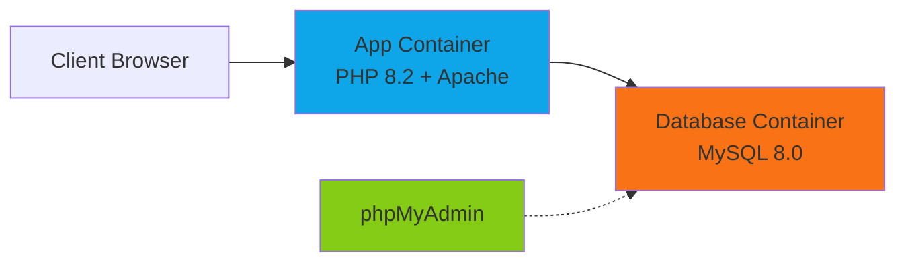

## Overview

CompuTécnicos uses Docker and Docker Compose to provide a consistent development and deployment environment. The application runs in isolated containers with all dependencies pre-configured.

## Architecture

The Docker setup consists of three main services:



### Services

<AccordionGroup>
  <Accordion title="app - PHP/Apache Application" icon="globe">
    - **Image**: PHP 8.2 with Apache
    - **Port**: 8080 (configurable via `APP_PORT`)
    - **Features**:
      - PHP extensions: PDO, MySQLi, GD, Zip, Intl, mbstring, XML
      - Composer for dependency management
      - Apache with mod_rewrite enabled
      - Persistent uploads and logs volumes
    - **Dependencies**: dompdf, PhpSpreadsheet, Google API Client
  </Accordion>

  <Accordion title="db - MySQL Database" icon="database">
    - **Image**: MySQL 8.0
    - **Port**: 3306 (configurable via `DB_PORT`)
    - **Features**:
      - UTF-8 (utf8mb4) character set
      - Automatic schema initialization
      - Health checks for reliable startup
      - Persistent data volume
    - **Configuration**: 64MB max packet size, native password authentication
  </Accordion>

  <Accordion title="phpmyadmin - Database Management" icon="table">
    - **Image**: phpMyAdmin latest
    - **Port**: 8081 (configurable via `PMA_PORT`)
    - **Profile**: dev (optional, for development only)
    - **Access**: Web-based MySQL management interface
  </Accordion>
</AccordionGroup>

## Environment Configuration

### Environment Variables

The `.env` file controls all configuration aspects:

<CodeGroup>

```bash Port Configuration
# External ports for accessing services
APP_PORT=8080        # Web application
DB_PORT=3306         # MySQL database
PMA_PORT=8081        # phpMyAdmin
```

```bash Database Configuration
DB_NAME=computecnicos                # Database name
DB_USER=computecnicos_user           # Application user
DB_PASS=computecnicos_secret         # Application password
MYSQL_ROOT_PASSWORD=root_secret      # MySQL root password
```

```bash PayPal Configuration
PAYPAL_CLIENT_ID=your_client_id
PAYPAL_CLIENT_SECRET=your_client_secret
PAYPAL_ENVIRONMENT=sandbox           # 'sandbox' or 'live'
```

```bash Electronic Invoicing
FE_PROVIDER=alegra                   # 'alegra' or 'siigo'
FE_SIMULATE=true                     # Simulation mode

# Alegra credentials (if using)
ALEGRA_TOKEN=
ALEGRA_EMAIL=

# Siigo credentials (if using)
SIIGO_CLIENT_ID=
SIIGO_CLIENT_SECRET=
SIIGO_USERNAME=
SIIGO_PASSWORD=
```

```bash Google OAuth (Optional)
GOOGLE_CLIENT_ID=
GOOGLE_CLIENT_SECRET=
```

</CodeGroup>

### Creating Your Configuration

<Steps>

<Step title="Copy Example File">
```bash
cp .env.example .env
```
</Step>

<Step title="Edit Variables">
Open `.env` in your text editor and update the values:

```bash
nano .env
# or
vim .env
# or use your preferred editor
```
</Step>

<Step title="Secure Production Values">
For production deployments, **always** change these values:

- All passwords (`DB_PASS`, `MYSQL_ROOT_PASSWORD`)
- PayPal credentials (switch to `live` environment)
- Invoice provider credentials
- Disable simulation mode (`FE_SIMULATE=false`)

<Warning>
Never commit the `.env` file to version control. It's already included in `.gitignore`.
</Warning>
</Step>

</Steps>

## Docker Compose Commands

### Basic Operations

<CodeGroup>

```bash Start All Services
# Build and start in detached mode
docker-compose up -d --build

# View startup logs
docker-compose logs -f
```

```bash Start with phpMyAdmin
# Use the 'dev' profile to include phpMyAdmin
docker-compose --profile dev up -d
```

```bash Stop Services
# Stop containers (keeps data)
docker-compose down

# Stop and remove volumes (⚠️ deletes database)
docker-compose down -v
```

```bash Restart After Changes
# Rebuild and restart
docker-compose up -d --build

# Restart specific service
docker-compose restart app
```

</CodeGroup>

### Monitoring and Debugging

<CodeGroup>

```bash Check Service Status
docker-compose ps
```

```bash View Logs
# All services
docker-compose logs -f

# Specific service
docker-compose logs -f app
docker-compose logs -f db

# Last 100 lines
docker-compose logs --tail=100 app
```

```bash Access Container Shell
# Application container
docker-compose exec app bash

# Database container
docker-compose exec db bash
```

```bash Execute Commands
# Run PHP script
docker-compose exec app php scripts/seed_random_products.php

# Access MySQL CLI
docker-compose exec db mysql -u computecnicos_user -pcomputecnicos_secret computecnicos
```

</CodeGroup>

## Database Management

### Initial Setup

The database is automatically initialized when the `db` container first starts:

1. MySQL creates the `computecnicos` database
2. The init script at `database/computecnicos_full.sql` runs automatically
3. All tables, sample data, and indexes are created

### Manual Database Operations

<CodeGroup>

```bash Import SQL File
# Import from host machine
docker-compose exec -T db mysql -u root -proot_secret computecnicos < database/computecnicos_full.sql
```

```bash Export Database
# Create backup
docker-compose exec db mysqldump -u root -proot_secret computecnicos > backup_$(date +%Y%m%d).sql

# Export with compression
docker-compose exec db mysqldump -u root -proot_secret computecnicos | gzip > backup_$(date +%Y%m%d).sql.gz
```

```bash Access MySQL CLI
# Quick access
docker-compose exec db mysql -u computecnicos_user -pcomputecnicos_secret computecnicos

# Root access
docker-compose exec db mysql -u root -proot_secret
```

```bash Reset Database
# ⚠️ This will delete all data!
docker-compose down -v
docker-compose up -d
```

</CodeGroup>

### Database Schema

The complete schema includes:

- **Core Tables**: usuarios, productos, categorias, marcas, pedidos
- **Inventory**: movimientos_inventario, proveedores
- **E-commerce**: carrito, detalle_pedido, pedido_estados
- **Invoicing**: facturas_electronicas, notas_credito
- **Reviews**: resenas, resenas_imagenes, comentarios_producto
- **Authentication**: password_resets, remember_tokens
- **Media**: imagenes_producto

## Volumes and Persistence

### Persistent Volumes

CompuTécnicos uses Docker volumes to persist important data:

```yaml
volumes:
  db_data:           # MySQL database files
  uploads_data:      # Product images and user uploads
  app_logs:          # Application logs
```

### Volume Management

<CodeGroup>

```bash List Volumes
docker volume ls
```

```bash Inspect Volume
docker volume inspect computecnicos_db_data
```

```bash Backup Uploads
# Copy uploads to host
docker cp computecnicos-app:/var/www/html/uploads ./backup/uploads
```

```bash Restore Uploads
# Copy from host to container
docker cp ./backup/uploads computecnicos-app:/var/www/html/
docker-compose exec app chown -R www-data:www-data /var/www/html/uploads
```

</CodeGroup>

## File Permissions

The application requires specific permissions for uploads and logs:

<CodeGroup>

```bash Fix Upload Permissions
docker-compose exec app chown -R www-data:www-data /var/www/html/uploads
docker-compose exec app chmod -R 775 /var/www/html/uploads
```

```bash Fix Log Permissions
docker-compose exec app chown -R www-data:www-data /var/www/html/logs
docker-compose exec app chmod -R 775 /var/www/html/logs
```

```bash Verify Permissions
docker-compose exec app ls -la /var/www/html/
```

</CodeGroup>

<Note>
These permissions are automatically set during container build, but you may need to fix them if you manually copy files.
</Note>

## Production Deployment

### Pre-Deployment Checklist

Before deploying to production:

<Steps>

<Step title="Update Environment Variables">
```bash .env
# Use strong, unique passwords
DB_PASS=use_a_strong_random_password
MYSQL_ROOT_PASSWORD=use_another_strong_password

# Switch PayPal to live mode
PAYPAL_ENVIRONMENT=live

# Disable invoice simulation
FE_SIMULATE=false

# Use production ports if needed
APP_PORT=80
```
</Step>

<Step title="Disable Development Tools">
Remove phpMyAdmin from production by **not** using the `dev` profile:

```bash
# Production start (without phpMyAdmin)
docker-compose up -d --build
```
</Step>

<Step title="Configure HTTPS">
Set up a reverse proxy (Nginx or Traefik) to handle HTTPS:

```nginx nginx.conf
server {
    listen 80;
    server_name computecnicos.com;
    return 301 https://$host$request_uri;
}

server {
    listen 443 ssl http2;
    server_name computecnicos.com;

    ssl_certificate /etc/letsencrypt/live/computecnicos.com/fullchain.pem;
    ssl_certificate_key /etc/letsencrypt/live/computecnicos.com/privkey.pem;

    location / {
        proxy_pass http://localhost:8080;
        proxy_set_header Host $host;
        proxy_set_header X-Real-IP $remote_addr;
        proxy_set_header X-Forwarded-For $proxy_add_x_forwarded_for;
        proxy_set_header X-Forwarded-Proto $scheme;
    }
}
```
</Step>

<Step title="Enable HTTPS Redirect">
Uncomment the HTTPS redirect in `.htaccess`:

```apache .htaccess
# Uncomment these lines for production:
RewriteCond %{HTTPS} off
RewriteRule ^(.*)$ https://%{HTTP_HOST}%{REQUEST_URI} [L,R=301]
```
</Step>

<Step title="Set Up Backups">
Create automated backups:

```bash backup.sh
#!/bin/bash
DATE=$(date +%Y%m%d_%H%M%S)
docker-compose exec db mysqldump -u root -proot_secret computecnicos | gzip > /backups/db_$DATE.sql.gz
docker cp computecnicos-app:/var/www/html/uploads /backups/uploads_$DATE
```
</Step>

</Steps>

### Deployment Commands

<CodeGroup>

```bash Deploy to Server
# On your server
git clone <repository-url> computecnicos
cd computecnicos

# Configure production environment
cp .env.example .env
nano .env  # Edit with production values

# Build and start
docker-compose up -d --build

# Verify
docker-compose ps
docker-compose logs -f app
```

```bash Update Deployment
# Pull latest changes
git pull origin main

# Rebuild and restart
docker-compose up -d --build

# Check logs for issues
docker-compose logs -f
```

</CodeGroup>

## Troubleshooting

### Application Won't Start

<Steps>

<Step title="Check Docker Status">
```bash
docker-compose ps
```

Look for containers with status other than "Up" or "healthy".
</Step>

<Step title="View Container Logs">
```bash
docker-compose logs app
docker-compose logs db
```

Look for error messages indicating the problem.
</Step>

<Step title="Verify Environment Variables">
```bash
docker-compose config
```

This shows the resolved configuration with all environment variables.
</Step>

<Step title="Rebuild from Scratch">
```bash
docker-compose down -v
docker-compose up -d --build --force-recreate
```

<Warning>
This deletes all data including the database. Only use for development.
</Warning>
</Step>

</Steps>

### Database Connection Issues

<AccordionGroup>
  <Accordion title="Connection Refused" icon="circle-xmark">
    **Symptoms**: Application shows "Connection refused" or can't connect to database.

    **Solutions**:
    1. Wait for database health check to complete:
       ```bash
       docker-compose logs db | grep "ready for connections"
       ```
    2. Verify database container is healthy:
       ```bash
       docker-compose ps db
       ```
    3. Check database credentials in `.env` match those in `config/database.php`
  </Accordion>

  <Accordion title="Access Denied" icon="lock">
    **Symptoms**: "Access denied for user" error.

    **Solutions**:
    1. Verify environment variables:
       ```bash
       docker-compose exec app env | grep DB_
       ```
    2. Reset database with correct credentials:
       ```bash
       docker-compose down -v
       docker-compose up -d
       ```
  </Accordion>

  <Accordion title="Database Not Initialized" icon="database">
    **Symptoms**: Tables don't exist or schema is missing.

    **Solutions**:
    1. Check if init script ran:
       ```bash
       docker-compose logs db | grep "computecnicos_full.sql"
       ```
    2. Manually import schema:
       ```bash
       docker-compose exec -T db mysql -u root -proot_secret computecnicos < database/computecnicos_full.sql
       ```
  </Accordion>
</AccordionGroup>

### Permission Issues

<CodeGroup>

```bash Upload Errors
# Fix upload directory permissions
docker-compose exec app chown -R www-data:www-data /var/www/html/uploads
docker-compose exec app chmod -R 775 /var/www/html/uploads
```

```bash Log Write Errors
# Fix log directory permissions
docker-compose exec app chown -R www-data:www-data /var/www/html/logs
docker-compose exec app chmod -R 775 /var/www/html/logs
```

```bash General Permission Fix
# Reset all permissions
docker-compose exec app chown -R www-data:www-data /var/www/html
docker-compose exec app chmod -R 755 /var/www/html
docker-compose exec app chmod -R 775 /var/www/html/uploads /var/www/html/logs
```

</CodeGroup>

### Performance Issues

<AccordionGroup>
  <Accordion title="Slow Container Startup" icon="hourglass">
    - Increase Docker Desktop memory allocation (Settings → Resources)
    - Use named volumes instead of bind mounts for better performance
    - On Windows, ensure WSL 2 backend is enabled
  </Accordion>

  <Accordion title="High Resource Usage" icon="gauge-high">
    - Limit MySQL memory usage in `docker-compose.yml`:
      ```yaml
      db:
        command: --max-connections=50 --key-buffer-size=16M
      ```
    - Enable PHP OPcache for better performance (already configured)
  </Accordion>
</AccordionGroup>

### Port Conflicts

If ports are already in use:

```bash .env
# Change ports in .env file
APP_PORT=8090
DB_PORT=3307
PMA_PORT=8082
```

Then restart:
```bash
docker-compose down
docker-compose up -d
```

## Advanced Configuration

### Custom PHP Configuration

Edit `docker/php/custom.ini` to customize PHP settings:

```ini docker/php/custom.ini
upload_max_filesize = 32M
post_max_size = 32M
memory_limit = 256M
max_execution_time = 120
display_errors = Off
log_errors = On
error_log = /var/www/html/logs/php_errors.log
```

Rebuild after changes:
```bash
docker-compose up -d --build
```

### MySQL Tuning

For production, tune MySQL performance in `docker-compose.yml`:

```yaml
db:
  command: >
    --default-authentication-plugin=mysql_native_password
    --character-set-server=utf8mb4
    --collation-server=utf8mb4_unicode_ci
    --max-allowed-packet=64M
    --innodb-buffer-pool-size=1G
    --max-connections=100
    --query-cache-size=0
```

### Health Checks

Add health checks to your `docker-compose.yml`:

```yaml
app:
  healthcheck:
    test: ["CMD", "curl", "-f", "http://localhost/status.php"]
    interval: 30s
    timeout: 10s
    retries: 3
    start_period: 40s
```

## Best Practices

<CardGroup cols={2}>
  <Card title="Security" icon="shield">
    - Use strong passwords in production
    - Disable phpMyAdmin in production
    - Enable HTTPS with valid certificates
    - Keep Docker images updated
    - Use secrets for sensitive data
  </Card>

  <Card title="Performance" icon="gauge">
    - Enable OPcache (already configured)
    - Use CDN for static assets
    - Implement database indexing
    - Monitor container resources
    - Use production PHP INI settings
  </Card>

  <Card title="Reliability" icon="check">
    - Set up automated backups
    - Use health checks
    - Implement log rotation
    - Monitor disk space
    - Test disaster recovery
  </Card>

  <Card title="Maintenance" icon="wrench">
    - Regular security updates
    - Monitor logs for errors
    - Clean up old volumes
    - Document configuration changes
    - Keep dependencies updated
  </Card>
</CardGroup>

## Next Steps

<CardGroup cols={2}>
  <Card title="Configuration Guide" icon="gear" href="/configuration/environment-variables">
    Configure PayPal, invoicing, and other integrations
  </Card>
  <Card title="Production Setup" icon="server" href="/deployment/production-setup">
    Learn about production deployment strategies
  </Card>
  <Card title="API Documentation" icon="book" href="/api/orders">
    Explore available APIs and endpoints
  </Card>
  <Card title="Admin Guide" icon="user-shield" href="/admin/dashboard-overview">
    Learn how to manage your store
  </Card>
</CardGroup>
